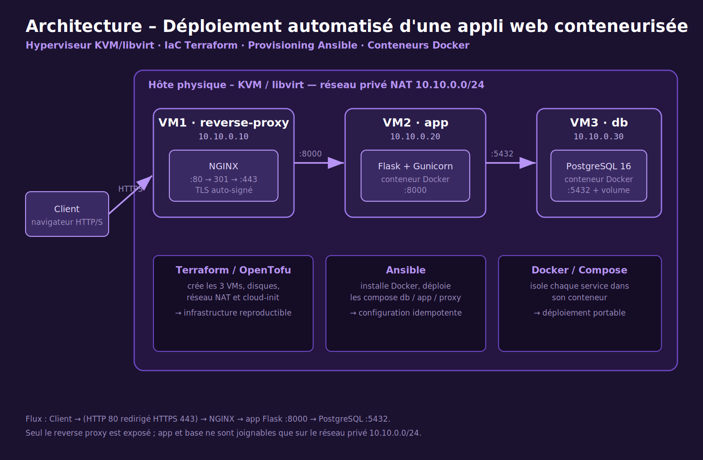

\newpage

# Introduction et contexte

Le sujet part d'une situation que je trouve assez réaliste : une PME héberge une application web interne installée « à la main » sur un seul serveur. Le problème, c'est que ce genre d'installation n'est jamais reproductible. Si le serveur tombe, ou s'il faut remonter l'appli ailleurs, on repart de zéro en espérant se souvenir de toutes les commandes tapées la première fois.

L'objectif du projet est donc de remplacer ce fonctionnement par une infrastructure moderne qui repose sur quatre principes vus en cours : la **virtualisation** (plusieurs machines isolées sur un même hôte), la **conteneurisation** (chaque service dans son conteneur), l'**Infrastructure as Code** (l'infra décrite dans des fichiers versionnés plutôt que cliquée à la souris) et l'**automatisation du déploiement**.

J'ai volontairement suivi le conseil donné à la fin du sujet : ne pas chercher à faire une usine à gaz, mais une solution simple, cohérente et entièrement automatisée. Tout ce qui suit peut être recréé de zéro avec deux commandes (`terraform apply` puis `ansible-playbook`), ce qui est exactement ce qui manquait dans la situation de départ.

L'infrastructure est déployée en local sur un hôte **KVM/libvirt**, qui était l'option la plus accessible pour moi puisque je l'utilise déjà dans mes TPs, et qui est 100 % open source comme recommandé dans le sujet.

# Présentation de l'architecture

L'architecture repose sur trois machines virtuelles, conformément au minimum demandé, chacune avec un rôle unique :

- **VM1 – reverse-proxy (`10.10.0.10`)** : c'est la seule machine exposée vers l'extérieur. Elle fait tourner un conteneur NGINX qui reçoit les requêtes des clients et les redirige vers l'application.
- **VM2 – app (`10.10.0.20`)** : héberge l'application web (Flask servie par Gunicorn) dans un conteneur Docker.
- **VM3 – db (`10.10.0.30`)** : héberge la base de données PostgreSQL dans un conteneur, avec un volume pour la persistance des données.

Le schéma ci-dessous résume l'ensemble (réseau, flux et chaîne d'outils) :



J'ai choisi de séparer les trois rôles sur trois VMs distinctes plutôt que de tout mettre sur une seule machine, parce que c'est ce découpage qui rend la chose intéressante du point de vue Cloud : chaque couche peut être redémarrée, sauvegardée ou redimensionnée indépendamment, et la base de données n'est jamais directement accessible depuis l'extérieur.

# Description de l'infrastructure virtualisée

## Hyperviseur et réseau

L'hôte est une machine Linux faisant tourner **KVM** avec **libvirt** comme couche de gestion. Les trois VMs partagent un réseau privé virtuel en mode **NAT**, sur le sous-réseau `10.10.0.0/24` :

| VM            | Rôle           | Adresse IP    | Ports exposés        |
|---------------|----------------|---------------|----------------------|
| reverse-proxy | NGINX          | 10.10.0.10    | 80, 443 (publics)    |
| app           | Flask/Gunicorn | 10.10.0.20    | 8000 (réseau privé)  |
| db            | PostgreSQL     | 10.10.0.30    | 5432 (réseau privé)  |

La passerelle du réseau est `10.10.0.1` (gérée par libvirt), ce qui permet aux VMs de sortir vers Internet pour télécharger les images Docker.

## Flux réseau

Le cheminement d'une requête est le suivant :

1. Le client arrive sur la VM1 en HTTP (port 80) ou HTTPS (port 443).
2. NGINX redirige systématiquement le HTTP vers le HTTPS (code 301), puis transmet la requête à l'application sur `10.10.0.20:8000`.
3. L'application interroge la base sur `10.10.0.30:5432` pour lire/écrire les données.

Le point important côté sécurité : **seule la VM1 est exposée**. Les ports 8000 (app) et 5432 (base) sont bindés sur l'IP privée des VMs, donc ils ne sont joignables que depuis l'intérieur du réseau `10.10.0.0/24`. Un client extérieur ne peut jamais taper directement la base de données.

## Rôle du reverse proxy

Le reverse proxy NGINX joue plusieurs rôles que j'ai compris en faisant le projet :

- **Point d'entrée unique** : on n'expose qu'une seule machine au lieu de trois.
- **Terminaison TLS** : c'est lui qui gère le HTTPS, l'application n'a pas à s'en occuper.
- **Découplage** : si demain je voulais mettre plusieurs instances de l'application derrière, c'est NGINX qui répartirait, sans rien changer côté client.

# Présentation du déploiement automatisé

Le déploiement se fait en deux étapes bien séparées : d'abord créer les machines (Terraform), ensuite les configurer (Ansible). J'ai gardé cette séparation parce qu'elle correspond à deux problèmes différents — provisionner du matériel virtuel d'un côté, installer du logiciel de l'autre.

## Étape 1 — Infrastructure as Code avec Terraform

J'ai utilisé **Terraform** avec le provider `dmacvicar/libvirt`. Le code décrit le pool de stockage, l'image de base Debian 12 (image *cloud* officielle), les trois disques dérivés, le réseau NAT et les trois VMs. Les machines sont définies dans une `map` pour éviter de me répéter trois fois :

```hcl
variable "vms" {
  type = map(object({ ip = string, vcpu = number, memory = number }))
  default = {
    reverse-proxy = { ip = "10.10.0.10", vcpu = 1, memory = 1024 }
    app           = { ip = "10.10.0.20", vcpu = 1, memory = 1536 }
    db            = { ip = "10.10.0.30", vcpu = 1, memory = 1536 }
  }
}
```

Chaque VM reçoit une configuration **cloud-init** générée à partir d'un template : ça crée l'utilisateur `cloud`, injecte ma clé SSH publique et fixe l'adresse IP statique. À la fin, `terraform output` affiche les IP et l'URL d'accès. L'intérêt principal, c'est qu'un `terraform destroy` suivi d'un `terraform apply` reconstruit exactement la même infra à l'identique.

## Étape 2 — Provisioning avec Ansible

Une fois les VMs en route, **Ansible** prend le relais. L'inventaire pointe sur les trois IP statiques, et le playbook `site.yml` applique quatre rôles dans l'ordre :

- `common` : installe Docker Engine et le plugin Compose sur toutes les VMs ;
- `database` : déploie le conteneur PostgreSQL ;
- `app` : copie le code de l'application, le *build* et le lance ;
- `reverse_proxy` : génère le certificat, configure NGINX et le démarre.

J'ai utilisé des rôles plutôt qu'un seul gros playbook parce que c'est plus lisible et que chaque rôle est réutilisable. Ansible étant **idempotent**, je peux relancer le playbook autant de fois que je veux sans tout casser : il ne refait que ce qui a changé.

# Description de la conteneurisation

Chaque service tourne dans son propre conteneur Docker, orchestré par un fichier `compose.yml` sur sa VM.

## Application (Flask)

L'application est une petite démo : un compteur de visites stocké en base, qui affiche aussi le nom du conteneur qui répond. C'est volontairement simple, mais ça prouve que toute la chaîne fonctionne (proxy → app → base). Le `Dockerfile` part de `python:3.12-slim`, installe les dépendances et lance **Gunicorn** plutôt que le serveur de développement de Flask (qui n'est pas fait pour la production) :

```dockerfile
FROM python:3.12-slim
WORKDIR /app
RUN apt-get update && apt-get install -y --no-install-recommends libpq5
COPY requirements.txt .
RUN pip install --no-cache-dir -r requirements.txt
COPY app.py entrypoint.sh ./
ENTRYPOINT ["./entrypoint.sh"]
```

Un détail sur lequel j'ai buté : au premier démarrage, l'application plantait parce que la base n'était pas encore prête. J'ai réglé ça avec un script d'`entrypoint` qui attend que PostgreSQL réponde avant de lancer Gunicorn.

## Base de données (PostgreSQL)

Le conteneur PostgreSQL utilise un **volume Docker** (`pgdata`) pour que les données survivent à un redémarrage ou à une recréation du conteneur. C'est le point qui m'a fait comprendre la différence entre un conteneur (éphémère) et un volume (persistant) :

```yaml
services:
  db:
    image: postgres:16
    environment:
      POSTGRES_DB: techapp
      POSTGRES_USER: techapp
      POSTGRES_PASSWORD: S3cret_demo!
    volumes:
      - pgdata:/var/lib/postgresql/data
volumes:
  pgdata:
```

## Reverse proxy (NGINX)

NGINX tourne aussi en conteneur, avec sa configuration et les certificats montés en *read-only* depuis l'hôte. La conf redirige le HTTP vers le HTTPS et fait suivre vers l'application.

# Analyse et justification des choix techniques

## Choix des technologies

- **KVM/libvirt** : open source, déjà maîtrisé en TP, et léger à faire tourner en local. Proxmox aurait apporté une jolie interface mais beaucoup plus lourde pour un projet de cette taille.
- **Terraform** : c'est l'outil IaC standard et le sujet le demande explicitement. Le provider libvirt permet de tout décrire sans toucher à `virsh` à la main. *(OpenTofu, le fork open source, fonctionnerait à l'identique avec le même code.)*
- **Ansible** : sans agent (juste du SSH), lisible en YAML, et idempotent. C'était le complément logique de Terraform pour la partie configuration.
- **Docker / Compose** : la conteneurisation demandée. Compose suffit largement ici ; Kubernetes aurait été surdimensionné pour trois conteneurs sur trois VMs.
- **Flask + PostgreSQL** : une appli Python simple à écrire et une base relationnelle classique, ça me permettait de me concentrer sur l'infra plutôt que sur le code applicatif.

## Avantages de la conteneurisation

Le gros avantage que j'ai constaté, c'est que l'application embarque ses dépendances. Je n'installe pas Python ni les librairies sur la VM : tout est dans l'image. Du coup l'app se comporte pareil partout, et la mise à jour revient à reconstruire une image plutôt qu'à bricoler le système. L'isolation est aussi un plus : un problème dans le conteneur de l'appli ne touche pas la base.

## Avantages de l'automatisation

Avant ce projet, j'aurais installé tout ça à la main. Là, l'infra complète se résume à deux commandes et à des fichiers versionnés sur Git. Concrètement : reproductibilité totale, traçabilité (l'historique Git montre qui a changé quoi), et un temps de remontée très court en cas de panne. C'est exactement le problème de départ de la PME qui est résolu.

## Limites de la solution

Je préfère être honnête sur ce qui n'est pas parfait :

- **Pas de haute disponibilité réelle** : chaque service est en un seul exemplaire. Si la VM de la base tombe, l'appli tombe avec.
- **Mot de passe de la base en clair** dans les variables Ansible. En vrai il faudrait passer par **Ansible Vault** ; je l'ai laissé en clair pour la lisibilité de la démo.
- **Certificat auto-signé** : le HTTPS fonctionne mais le navigateur affiche un avertissement, puisqu'aucune autorité reconnue ne l'a signé.
- **Pas de sauvegarde automatisée** de la base à ce stade — c'est le premier point que j'ajouterais.

# Conclusion

Ce projet m'a permis de relier des briques que j'avais vues séparément en cours : virtualisation, IaC, configuration automatisée et conteneurs. Le résultat est une infrastructure que je peux détruire et reconstruire à l'identique en quelques minutes, ce qui répond directement au problème de départ — une installation manuelle et non reproductible.

Si je devais aller plus loin, je commencerais par les points de la section « limites » : sécuriser les secrets avec Ansible Vault, ajouter une sauvegarde planifiée de PostgreSQL, puis seulement ensuite réfléchir à de la haute disponibilité. Mais conformément au conseil du sujet, j'ai préféré livrer une base simple, cohérente et entièrement automatisée plutôt qu'une architecture ambitieuse et bancale.

\newpage

# Annexe — Reproduire le déploiement

```bash
# 1. Créer l'infrastructure (VMs, réseau, cloud-init)
cd terraform/
cp terraform.tfvars.example terraform.tfvars   # renseigner sa clé SSH
terraform init
terraform apply

# 2. Configurer et déployer les services
cd ../ansible/
ansible-playbook site.yml

# 3. Accès
#   https://10.10.0.10/   (certificat auto-signé : accepter l'avertissement)
```

L'arborescence complète du dépôt :

```
projet-cloud-computing/
├── terraform/      # IaC : VMs, réseau, cloud-init
├── ansible/        # provisioning : 4 rôles (common, database, app, reverse_proxy)
├── app/            # application Flask + Dockerfile
├── schema/         # schéma d'architecture
└── rapport/        # ce rapport (source Markdown + PDF)
```
